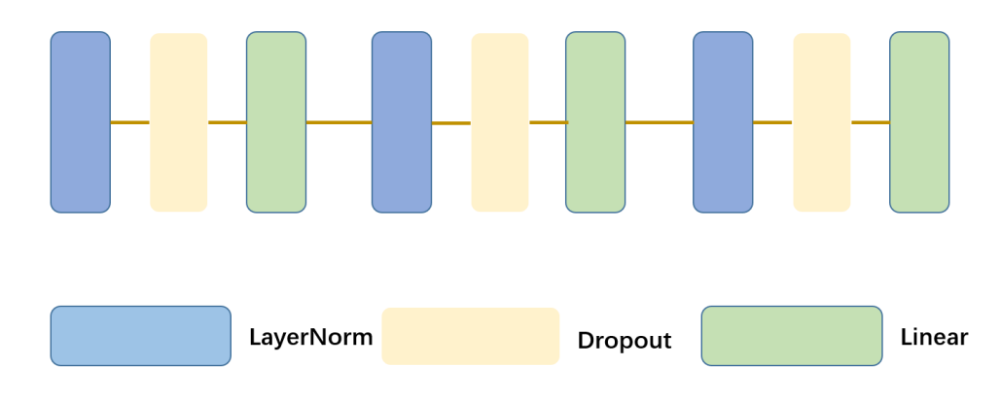
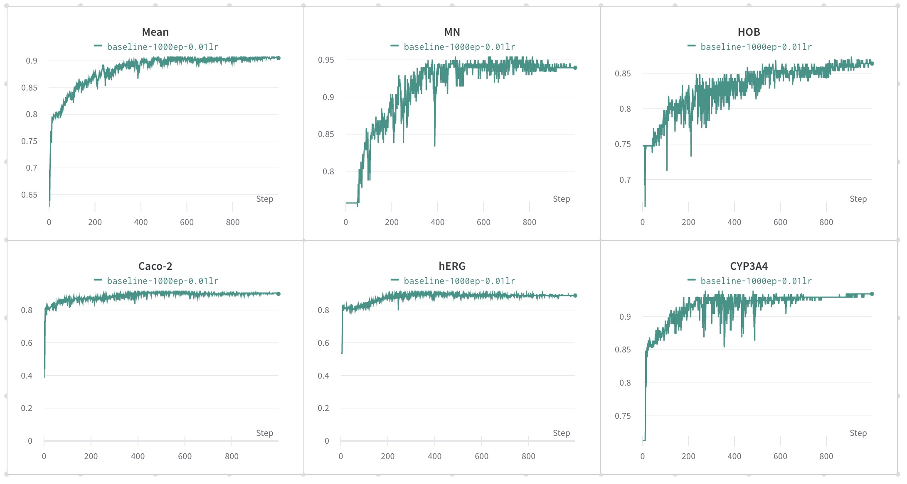

# 2021年华为杯第十八届中国研究生数学建模竞赛D题解决方案

## 环境搭建

* python3.7, pillow, tqdm, torchfile, pytorch1.1+ (for inference)

  ```
  pip install pillow
  pip install tqdm
  pip install torchfile
  conda install pytorch==1.1.0 torchvision==0.3.0 -c pytorch
  ```

* 接下来克隆这个仓库：

    ```
    git clone https://github.com/rnzhiw/HuaweiCupMathModel.git
    ```

## 问题分析

* 第一问采用随机森林+相关性分析筛选20个变量
* 第二问采用决策树回归、线性回归、梯度提升向量机、随机 森林回归、多层次感知机回归、XGBoost 回归和LightGBM 模型对生物活性预测。最终得出LightGBM 模型的效果比较好
* 第三问采用多层感知机(MLP)对化合物的 ADMET 性质进行预测。训练集采用90%的样本，测试集采用10%的样本。五种性质的平均准确率为90.5%
* 第四问采用改进型贪心调优


## 模型结构

第三问的模型结构彩图



介绍

在该问题中，学习率为0.01的时候有比较好的效果，准确率达到了90.5%，使用了Dropout、Dice Loss、Adam 优化器、Poly 学习率衰减和 Kaiming 初始化。

接下来是模型在lr=0.01的情况下的五种性质预测准确率图：



## License

This repository is released under the Apache 2.0 license as found in the [LICENSE](https://github.com/rnzhiw/Parallel_hyperparameter_optimization_for_loan_default_prediction/blob/main/LICENSE.md) file.
